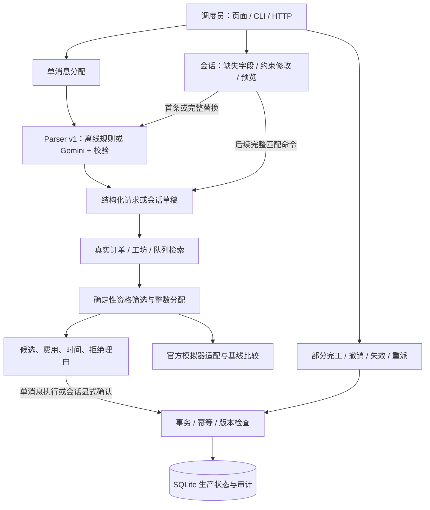

# SweaterCo Dispatch Desk 项目整体说明

更新：2026-10-06，MVP v0.4。项目对应 DSS5105 Track 2：Quick-Response Subcontracting Desk，为小批量服装订单选择合适外包工坊。

## 1. 问题、用户与价值

调度员需要同时核对工坊品类、状态、批量上限、队列、价格和交期。群聊中的请求可能缺订单号、包含排除条件，或指定不合格工坊。系统把这些需求转换成可核对的结构化记录，以确定性代码计算候选方案，再保存分配和生产变更。

目前可以证明的是功能正确性、操作可追溯性和课程模拟器中的指标变化；尚未测量真实调度员节省的时间、真实成本收益或生产现场效果。

## 2. 架构与数据流

LLM 只做输入提取，不决定资格、不计算金额/天数、不直接写库。会话是显式状态机，后续短回复按有限语法合并；没有让模型自行推测历史约束。

## 3. 模块与接口

| 模块 | 入口 | 责任与边界 |
|---|---|---|
| 解析与校验 | app/agent/parser.py | 严格 Schema、原文证据、最多一次重试；失败不分配 |
| 会话 | app/sessions.py | ACTIVE / AWAITING_CLARIFICATION / CLOSED，版本、消息、显式确认 |
| 检索 | app/repositories | 精确订单 ID、主数据冲突、实时队列；不猜客户对应订单 |
| 分配 | app/allocator/planner.py | 单工坊/整数拆单、最大工坊数、排除与指定工坊、软/硬交期 |
| 持久化主链路 | app/pipeline.py | requests、解析历史、决策、工作分配、队列一起提交 |
| 生产事件 | app/lifecycle.py | complete/cancel/lapse/reassign、部分完工守恒、操作者和原因 |
| 本机界面 | app/server.py、app/ui | 英文登录、概览、推荐与澄清、决策理由、历史导出、工坊查询、生产操作 |
| 账号与读取模型 | app/auth.py、app/desk.py | 本地登录、服务端审批身份、全量审计与统计；账号共享工作区 |
| 评估 | evaluation/verify_mvp.py | 回归、持久化演示、官方基线与新策略对比 |

新界面详见 [UI 修改说明](UI_CHANGELOG_CN.md)、[操作指南](UI_GUIDE_CN.md) 和 [验收边界](UI_ACCEPTANCE_CN.md)。HTTP 业务接口默认需要登录，原中文页面保留在 `/legacy`。

接口明细与命令示例见 [系统手册](SYSTEM_GUIDE_CN.md)、[会话手册](SESSIONS_CN.md) 和 [生命周期手册](LIFECYCLE_CN.md)。

## 4. 数据与核心规则

原始 CSV 包含 120 个订单和 8 个工坊；86 个源 COMPLETE 订单导入为 COMPLETED，其他订单作为 READY。原始 CSV 是首次初始化种子；后续运行以 SQLite 为准，改 CSV 不会同步已有库。

工坊需满足 ACTIVE、品类能力、批量上限和用户排除规则。指定工坊必须接收整单。默认最多一个工坊；允许 N 个表示上限。费用、队列和估计时间均来自代码。订单已分配、完成或失效时禁止再次分配；部分完工后只分配剩余件数。

业务日期默认 2026-04-01，日志时间使用真实 UTC。队列按 FIFO 和日历天衰减；预测队列归零不等于确认完工。交期默认软提示，明确要求准时才成为硬约束。cancel 撤销剩余分配并回到 READY；lapse 终止订单。

## 5. 目标配置与评估证据

可配置 min_delay、min_cost、min_defects、hybrid。min_delay 最小化预计整体完成时间，是周转时间目标；没有声称求得全局最少迟交。hybrid 使用 `0.6 × days + 0.4 × defect_rate × 100`，权重沿用现有启发式，尚未按业务效用校准。

本版在不改官方 harness 的前提下，适配相同生产 planner 的单工坊模式。固定 seed 5105，全部 120 订单，每个目标及三种基线均跑 standard/shock，共 14 组。

| 标准场景 | 平均天数 | 迟交率 | 缺陷率 | 总成本 |
|---|---:|---:|---:|---:|
| random | 21.52 | 34.17% | 4.17% | 111780 |
| greedy_biggest | 49.02 | 84.17% | 4.17% | 108430 |
| cheapest | 105.13 | 93.33% | 7.50% | 85960 |
| planner_min_delay | 8.05 | 1.67% | 5.00% | 115640 |
| planner_hybrid | 8.79 | 2.50% | 3.33% | 113480 |

速度目标在时间指标上更好，同时成本高于三种基线，缺陷率也不全面占优。纯 min_cost 与 cheapest 在本次结果中相同。完整 P90、集中程度、缺陷目标、冲击和基线胜出情况见 [对比报告](../evaluation/results/simulator_comparison_CN.md)。

181 条 Python 自动测试及 5 条前端控制器测试通过、0 跳过；60/60 离线解析、30/30 原始行为回归、生命周期和会话连续演示通过。60 条标注是开发回归集，不是独立盲测；30 条成绩只描述行为匹配，解释忠实性需另评。真实 Gemini 最新全量验收仍因 429 失败，不能用离线成绩替代。

## 6. 工程保证与适用范围

所有生产变更有事务保护；同 key 重放不重复计入队列，订单和会话版本阻止过期修改。会话预览不写生产状态，确认在锁内重算最新数据；其他订单的队列变化可改变最终方案。SQL 失败回滚会话与生产数据。

已验证 v1/v2/v3 到 v4 的事务迁移；原 Pipeline v0.2 版本保持不变以保留既有幂等语义。迁移、新增表和字段见 [数据库说明](DATABASE_SCHEMA_CN.md)，部署和恢复见 [部署说明](DEPLOYMENT_CN.md)。

## 7. 尚未完成与后续路线

当前定位是可运行、可审计、可演示的本机课程 MVP。尚未完成：真实 LLM 全量验收、独立 holdout、第二人标签复核、解释忠实性评分、工坊状态/产能管理、自动过期和公网权限体系。原始 Data Schema2 仍缺失；团队主目标、时间政策和生命周期业务含义仍需书面确认。

Week 9 Sprint 1 可用本版展示架构、早期结果与局限；后续优先在线可靠性、独立评估和数据管理。具体清单见 [下一阶段交接](NEXT_STAGE_CN.md)。
